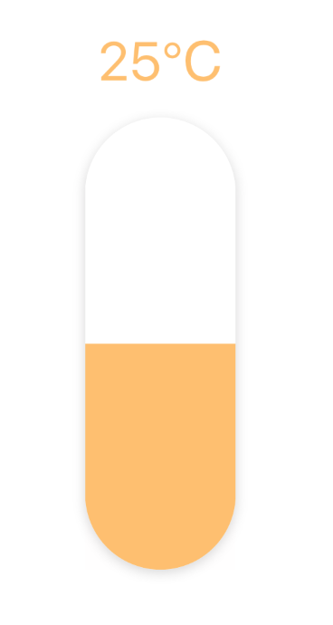

# react-native-column-slider

A pure JavaScript Slider component, UI similar to iPhone brightness regulator.

<div align=center></div>

## Usage

```bash
$ npm i react-native-column-slider
```

```js
import React from 'react';
import { StyleSheet, View } from 'react-native';
import ColumnSlider from 'react-native-column-slider';

export default class App extends React.PureComponent {
  render() {
    return (
        <View style={styles.container}>
          <ColumnSlider
              height={300}
              width={100}
              min={0}
              max={50}
              step={1}
              minimumTrackTintColor='#ffc069'
              maximumTrackTintColor='#fff'
              textStyle={{ color: '#ffc069' }}
              suffix="℃"
          />
        </View>
    );
  }
}

const styles = StyleSheet.create({
  container: {
    flex: 1,
    justifyContent: 'center',
    alignItems: 'center',
  },
});
```

## Props

|Property|Type|Default|Description|
|:---|:---|:---|:---|
|value|number|0|Initial value of the slider.|
|disabled|bool|false|If true the user won't be able to move the slider.|
|min|number|0|Initial minimum value of the slider.|
|max|number|0|Initial maximum value of the slider.|
|step|number|0|Step value of the slider. The value should be between 0 and maximumValue - minimumValue).|
|minimumTrackTintColor|string|'#fff'|The bottom color.|
|maximumTrackTintColor|string|'#eee'|The top color.|
|onChange|function|null|Callback continuously called while the user is dragging the slider.|
|onComplete|function|null|Callback called when the user finishes changing the value (e.g. when the slider is released).|
|style|[style](https://facebook.github.io/react-native/docs/view.html#style)|null|The style applied to the slider container.|
|textStyle|object|null|The style applied to the value text.|
|icon|node|null|The bottom icon.|
|width|number|100|The with of component.|
|suffix|string|null|The suffix of the value.|
|borderRadius|number|0|The border radius of component.|